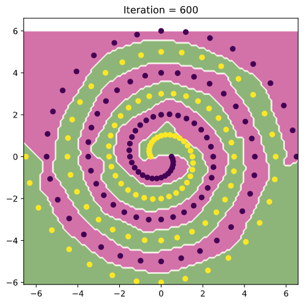
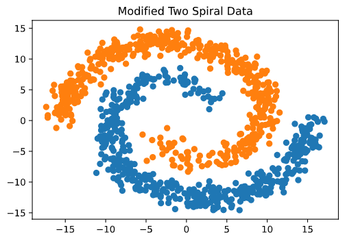
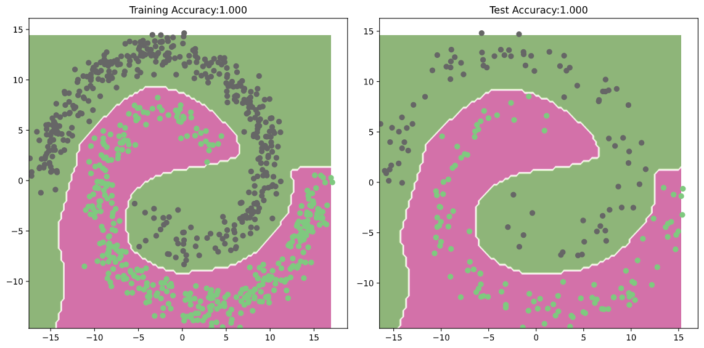
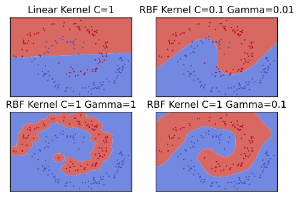

# Two-Spiral Classification
A comparison of ANN and SVM model performance on the two-spiral and modified two-spiral classification tasks. 

# Original Two-Spiral Dataset

## Artificial Neural Network

A feed-forward ANN using PyTorch with layer dimensions: 2-16-32-1; Learning rate: 0.1

Network Architecture: 

Sequential (  
(0): Linear (in_features=2, out_features=16, bias=True)  
(1): ELU (alpha=1.0)  
(2): Linear (in_features=16, out_features=32, bias=True)   
(3): ELU (alpha=1.0)  
(4): Linear (in_features=32, out_features=1, bias=True)   
(5): Sigmoid () )  

ANN decision boundary after 600 iterations:  

## Support Vector Machine

SVM decision boundary:  

# Modified Two-Spiral Dataset

## Trained and Tested Artificial Neural Network

A feed-forward ANN using PyTorch with layer dimensions: 2-16-32-1; Learning rate: 0.1

Network Architecture: 

Sequential (  
(0): Linear (in_features=2, out_features=16, bias=True)  
(1): ELU (alpha=1.0)  
(2): Linear (in_features=16, out_features=32, bias=True)   
(3): ELU (alpha=1.0)  
(4): Linear (in_features=32, out_features=1, bias=True)   
(5): Sigmoid () ) 

## Support Vector Machines

Comparison SVM parameters with decision boundaries visualised: 

